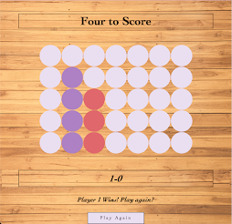

# Four to Score

### Description

This connect four game features a welcome screen that describes the game and rules, which then directs to a new page where the game is played. Player 1 and Player 2 alternate moves until someone gets 4 in a row. Each time a round is won, the winning player gains a point on the scoreboard. There will then be a message announcing the winner and an option to play again.

### How to Get Started

- Fork and clone this repo
- `cd` into folder
- Open in broswer with `open.html`
- To make edits, open in VS code with `code .`
- Or, play **here** now on Surge [Four to Score](https://paiges-fourtoscore.surge.sh/)

### Main JavaScript Elements Used:

- `document.querySelector()` and `document.getElementsClassName()` were used to access my HTML elements and use the in my JavaScript
- ES6 Syntax was used to name all functions
- `addEventListener` was used to control what happens when spaces are clicked
- A `for` loop was used to loop through the winning combination array
- Used `for, of` loop was used to manipulate a single space out of my elements with the class of 'spaces'
- `parseInt()` was used to manipulate the ID of the board spaces and use their numerical value

### Credits

https://bobbyhadz.com/blog/javascript-addeventlistener-is-not-a-function#:~:text=The%20%22addEventListener%20is%20not%20a,method%20(it's%20case%20sensitive)

https://images.pexels.com/photos/129731/pexels-photo-129731.jpeg?cs=srgb&dl=pexels-fwstudio-129731.jpg&fm=jpg

### Trello Board Link:

https://trello.com/invite/b/yLMbebpO/2827b5b212932293238ca90dc9521093/connect-four-project
